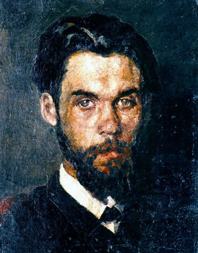
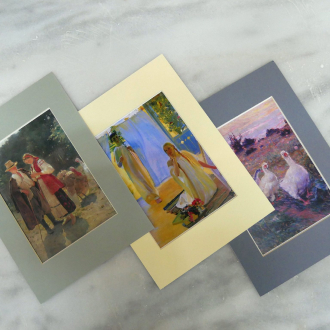

<!DOCTYPE html>
<html lang="en" class="page">
  <head>
    <meta charset="UTF-8">
    <meta name="viewport" content="width=device-width, initial-scale=1.0">
    <title>Museum 2</title>
    <link 
      rel="shortcut icon" 
      href="./images/icon/logo-favicon.svg" 
      type="image/x-icon"
    >
    <link href="https://fonts.googleapis.com/css2?family=Playfair+Display:wght@700&family=Raleway:wght@400;600&display=swap" rel="stylesheet">
    <link rel="stylesheet" href="./styles/main.scss">
  </head>
  <body class="page__body">
    <header class="page__header header">
      

        

          

            

              
      
              

                <form 
                  action="#" 
                  method="get" 
                  class="change-language"
                >
                  <select 
                    name="language" 
                    id="language"
                    class="change-language__field"
                  >
                    <option value="ua" class="change-language__option">
                      UA
                    </option>
      
                    <option value="en" class="change-language__option" selected>
                      EN
                    </option>
                  </select>
                </form>
        
                
              

            

          

  
          

            August 10 - November 10
          

  
          <h1 class="header__title">
            Art of the 19th - 20th centuries.
          </h1>
  
          

            The contribution of Ukrainian artists to the world culture of the 19th and 20th centuries.
          

          <a href="#">
            <button class="
              header__button 
              button 
              button--main
            ">
              Buy a ticket
            </button>
          </a>
  
          

            10.08 - 10.10
          

        

        

      

    </header>

    

      

        

          

            
    
            

              <form 
                action="#" 
                method="get" 
                class="sidebar__change-language change-language"
              >
                <select 
                  name="language" 
                  id="language-sidebar"
                  class="change-language__field"
                >
                  <option value="ua" class="change-language__option">
                    UA
                  </option>
    
                  <option value="en" class="change-language__option" selected>
                    EN
                  </option>
                </select>
              </form>
      
              
            

          

        

      

      

        

          

            

              

                

                  Schedule today:
                

      
                

                  12:00 - 19:00
                

              

      
              

                

                  Address:
                

      
                <a 
                  href="https://goo.gl/maps/9hBCm5outDMgfvUs9" 
                  class="sidebar__content-item sidebar__link"
                  target="_blank"
                >
                  Kyiv, str. M. Hrushevsky, 6
                </a>
              

            

    
            <nav class="sidear__nav nav">
              <ul class="nav__list">
                <li class="nav__item nav__item--sidebar">
                  <a href="#actual-exhibitions" class="nav__link nav__link--sidebar">
                    Actual exhibitions
                  </a>
                </li>
    
                <li class="nav__item nav__item--sidebar">
                  <a href="#upcoming-events" class="nav__link nav__link--sidebar">
                    Upcoming events
                  </a>
                </li>
    
                <li class="nav__item nav__item--sidebar">
                  <a href="#news" class="nav__link nav__link--sidebar">
                    News
                  </a>
                </li>
              </ul>
            </nav>
          

          <a href="#">
            <button class="
              sidebar__button 
              button 
              button--main
            ">
              Buy a ticket
            </button>
          </a>
        

      

      

    

    <main>
      <section 
        class="page__actual-exhibitions actual-exhibitions" 
        id="actual-exhibitions"
      >
        

          

            <h2 class="page__section-title">
              Actual exhibitions
            </h2>

            <a href="#">
              <button class="
                button
                button--primary
                title__button
              ">
                Archive of exhibitions
              </button>
            </a>
          

          

            

              <picture>
                <source 
                  srcset="./images/paintings/image1-1280px.jpg"
                  media="(min-width: 1280px)" 
                >
                
              </picture>
    
              
                11.07 - 22.09
              
    
              <h3 class="card__title">
                Curated exhibition "Angels"
              </h3>
            
              

                The exhibition project "Angels" is a landmark event for Ukrainian culture and at the same time the largest...
              

    
              <a href="#" class="
                card__button 
                button
                button--main
              ">
                Buy a ticket
              </a>
            

            

              <picture>
                <source 
                  srcset="./images/paintings/image2-1280px.jpg"
                  media="(min-width: 1280px)" 
                >
                
              </picture>

              
                Works constantly
              
    
              <h3 class="card__title">
                Art of the 20th century — XXI century.
              </h3>

              

                Iconic works by Alla Horska, Mykola Samokysh, Fedor Krychevsky and other artists.
              

    
              <a href="#" class="
                card__button 
                button
                button--main
              ">
                Buy a ticket
              </a>
            

          

          <a href="#">
            <button class="
              button
              button--primary
            ">
              Archive of exhibitions
            </button>
          </a>
        

      </section>

      <section 
        class="page__upcoming-events upcoming-events"
        id="upcoming-events"
      >
        

          

            <h2 class="page__section-title">
              Upcoming events
            </h2>

            <a href="#">
              <button class="
                button
                button--primary
                title__button
              ">
                Calendar of events
              </button>
            </a>
          

          

            

            

              
                14.08 at 13:00
              
    
              <h3 class="card__title">
                Curated tours by Pavel Gudimov
              </h3>
            
              

                The secrets of preparation, the history of the exhibits, the magic of action before and during your presence will unfold...
              

              <a href="#">
                <button class="
                  card__button 
                  button
                  button--main
                ">
                  Register
                </button>
              </a>
            

          

          

            

            

              
                16.08 at 13:00
              
    
              <h3 class="card__title">
                Master class "Travel to Australia"
              </h3>
            
              

                This Sunday at 2:00 p.m., the last point of the round-the-world trip awaits art travelers - Australia.
              

              <a href="#">
                <button class="
                  card__button 
                  button
                  button--main
                ">
                  Register
                </button>
              </a>
            

          

          <a href="#">
            <button class="
              button
              button--primary
            ">
              Calendar of events
            </button>
          </a>
        

      </section>

      <section class="page__visit-to-museum visit-to-museum">
        

          

            <h2 class="visit-to-museum__title">
              Plan a visit to the museum
            </h2>
  
            

              Choose a convenient day, register for events of interest, buy a ticket in advance so that nothing prevents you from enjoying art.
            

            <a href="#">
              <button class="
                button
                button--main
              ">
                Begin
              </button>
            </a>
          

        

      </section>

      <section 
        class="page__news news" 
        id="news"
      >
        

          

            <h2 class="page__section-title">
              News
            </h2>

            <a href="#">
              <button class="
                button
                button--primary
                title__button
              ">
                All news
              </button>
            </a>
          

          

            

              <picture>
                <source 
                  srcset="./images/paintings/image5-1280px.jpg"
                  media="(min-width: 1280px)" 
                >
                
              </picture>

              
                August 9, 2019
              
    
              <h3 class="card-news__title">
                Announcement of the winner
              </h3>
            
              

                Friends, today is Friday! And that means it's time to announce the winner of the raffle...
              

            

            

              <picture>
                <source 
                  srcset="./images/paintings/image6-1280px.jpg"
                  media="(min-width: 1280px)" 
                >
                
              </picture>

              
                August 9, 2019
              
    
              <h3 class="card-news__title">
                International Cat Day
              </h3>
            
              

                A museum with lions cannot simply take and miss International Cat Day!
              

            

          

          
          <a href="#">
            <button class="
              card__button 
              button
              button--primary
            ">
              All news
            </button>
          </a>
        

      </section>

      <section class="page__subscription subscription">
        

          

            <h2 class="page__section-title subscription__title">
              Subscribe to the digest
            </h2>
  
            

              Be the first to hear about museum news and raffles, receive invitations to events and read articles from curators
            

          

          <form 
            action="#"
            method="post"
            class="form"
            id="form"
          >
            <input 
              type="email"
              name="email"
              id="email"
              class="form__field"
              placeholder="e-mail"
              required
            >

            <button form="form" class="
              form
              form__submit
              button
              button--main
            ">
              Subscribe
            </button>
          </form>
        

      </section>
    </main>

    <footer class="page__footer footer">
      

        

          <section class="footer__section contacts">
            <h2 class="footer__section-title">
              Contacts
            </h2>
  
            

              <a 
                href="https://goo.gl/maps/9hBCm5outDMgfvUs9" 
                target="_blank"
                class="contacts__link"
              >
                Kyiv,
                 
                st. M. Hrushevsky, 6
              </a>
  
              

                tel.
                <a href="tel:278-13-57" class="contacts__link">
                  278-13-57
                </a>,

                <a href="tel:278-74-54" class="contacts__link">
                  278-74-54
                </a>
              

  
              <a href="mailto:info@namu.kiev.ua" class="contacts__link">
                info@namu.kiev.ua
              </a>
            

  
            

              
  
              
  
              
  
              
            

          </section>
  
          <section class="footer__section work-schedule">
            <h2 class="footer__section-title">
              Work schedule
            </h2>
  
            

              MON: day off
               
              TUE: day off
               
              WED: 10:00 - 17:00
               
              THU: 10:00 - 17:00
               
              FRI: 12:00 - 19:00
               
              SAT: 11:00 - 18:00
               
              SUN: 10:00 - 17:00
            

          </section>
  
          <nav class="footer__nav nav">
            <ul class="nav__list">
              <li class="nav__item footer__section-title">
                <a href="#" class="nav__link nav__link--footer-first">
                  Main
                </a>
              </li>
  
              <li class="nav__item nav__item--footer">
                <a href="#actual-exhibitions" class="nav__link nav__link--footer">
                  Exhibitions
                </a>
              </li>
  
              <li class="nav__item nav__item--footer">
                <a href="#upcoming-events" class="nav__link nav__link--footer">
                  Events
                </a>
              </li>
  
              <li class="nav__item nav__item--footer">
                <a href="#news" class="nav__link nav__link--footer">
                  News
                </a>
              </li>
            </ul>
          </nav>
        

        

        

          

            
              © 2010 — 2020
            
  
            
              Privacy — Terms
            
          
 
  
          
        

      

    </footer>

    
  </body>
</html>
